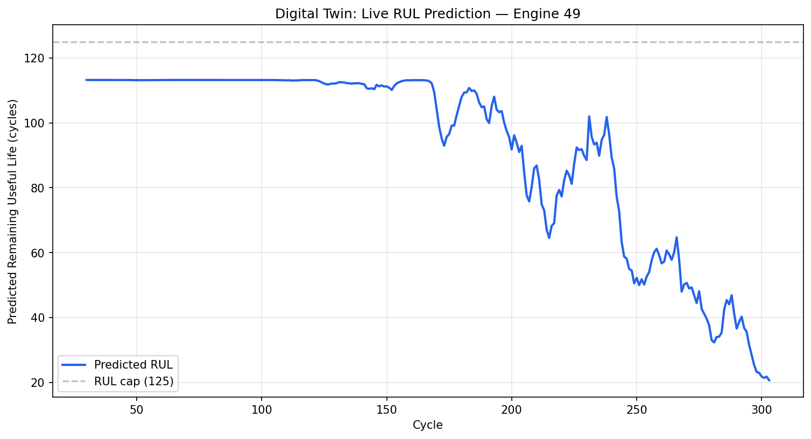

# Turbofan Engine Remaining Useful Life (RUL) Prediction — LSTM

A deep learning approach to aircraft engine prognostics: predicting how many operational cycles remain before a turbofan engine fails, using multivariate sensor time-series data.

🔗 [Live Demo](https://aircraft-engine-prognostics-lstm-dsnevfppq8gtekvqyo3scn.streamlit.app/)

## Problem

In Prognostics and Health Management (PHM), predicting equipment failure before it happens allows maintenance to be scheduled proactively — avoiding both unnecessary early part replacement and dangerous late failure. This project builds a model that estimates an engine's Remaining Useful Life (RUL) from its recent sensor history, using NASA's C-MAPSS turbofan degradation simulation dataset (FD001 subset).

## Dataset

- **Source:** NASA C-MAPSS Turbofan Engine Degradation Simulation (FD001)
- **Training set:** 100 engines, run-to-failure (full sensor history from healthy to failure)
- **Test set:** 100 different engines, sensor history truncated before failure; true RUL provided separately as the evaluation target
- 21 sensor channels + 3 operational settings recorded per cycle; 7 sensors were found to have zero variance in this subset and were dropped

## Approach

1. **RUL labeling:** computed ground-truth RUL for training data (failure cycle − current cycle), then applied the standard piecewise-linear cap (max RUL = 125) — since early-life degradation isn't reliably predictable from sensor data alone, matching the pattern observed directly in the raw sensor plots.
2. **Feature scaling:** min-max normalization fit only on training data, applied to test data (avoiding data leakage).
3. **Sequence windowing:** 30-cycle sliding windows used as model input, so the model learns from trends over time rather than single-cycle snapshots.
4. **Baseline model:** a flat feedforward network (ignores sequence order) trained as an honest point of comparison.
5. **LSTM model:** 2-layer LSTM (64 hidden units) that processes the 30-cycle window sequentially, predicting RUL from the final hidden state.
6. **Evaluation:** RMSE, and the official asymmetric NASA PHM08 scoring function, which penalizes late (dangerously optimistic) predictions more heavily than early ones — the operationally relevant metric in real aerospace use.

## Results

| Metric | Baseline (Dense NN) | LSTM |
|---|---|---|
| Test RMSE (cycles) | 14.39 | **13.23** |
| PHM Score (asymmetric, lower is better) | 433.59 | **246.35** |

The LSTM's advantage is modest on RMSE (~8%) but substantial on the PHM score (~43%) — indicating it makes meaningfully fewer dangerously-late predictions, even though its average error is only somewhat lower. This matters more in practice than RMSE alone, since late predictions are the operationally costly failure mode in real prognostics systems.

## Debugging note (kept intentionally — this was a real part of the process)

The first LSTM training attempt appeared to converge (loss plateaued) but had actually collapsed to predicting a near-constant output regardless of input — confirmed by checking prediction standard deviation (~0, vs. ~40 for true RUL values). This was resolved by lowering the learning rate (0.001 → 0.0005) and adding gradient clipping (max norm 1.0), both standard fixes for LSTM training instability. A train/validation split (by engine unit, to avoid data leakage) was added afterward to properly monitor for overfitting during longer training runs.

## "Digital Twin" simulation

To connect this to live prognostics monitoring (rather than a single static prediction), the trained LSTM was run in a simulated streaming mode over one held-out test engine (Engine 49, 303 cycles) — generating a live RUL prediction at every cycle as if new sensor data were arriving in real time. The resulting prediction curve shows a stable, high RUL estimate during the engine's healthy early life, followed by a clear downward trend as degradation becomes evident in later cycles — consistent with the underlying physical behavior visible in the raw sensor data.

*(Note: this is a simulation replaying historical data cycle-by-cycle, not a live connection to physical sensors — an honest limitation worth stating clearly.)*

## What I'd improve with more time

- Hyperparameter tuning (window size, hidden size, number of layers) via systematic search rather than manual iteration
- Attention mechanisms or a Transformer-based architecture, which some recent PHM literature suggests can outperform LSTMs on this benchmark
- Testing on the harder FD002/FD004 subsets (multiple operating conditions)
- Uncertainty quantification (confidence intervals on predictions, not just point estimates) — important for real operational trust

## Tech Stack

Python, PyTorch, Pandas, NumPy, Matplotlib, scikit-learn, Google Colab (free GPU)
